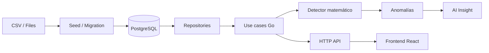

# Arquitectura del sistema

## Propósito

Esta aplicación analiza lecturas eléctricas y eventos operativos para detectar anomalías de consumo, conservar evidencia y ofrecer una explicación accionable de cada hallazgo. El valor principal no está solo en producir alertas, sino en justificar por qué se emitieron y cómo se relacionan con el contexto operativo.

## Objetivos del diseño

- Mantener un cálculo determinista y reproducible de anomalías.
- Separar dominio, casos de uso e infraestructura.
- Permitir una explicación opcional con IA sin depender de ella para detectar el problema.
- Exponer datos a un frontend React con un contrato HTTP claro y versionado.

## Visión general

## Capas
a

### 1. Dominio

Los paquetes del dominio modelan la lógica de negocio sin depender del transporte ni de la infraestructura externa.

- `backend/internal/reading`: lecturas y series temporales.
- `backend/internal/event`: eventos operativos y cambios de estado.
- `backend/internal/anomaly`: tipos de anomalía, severidad, evidencia, reglas y detector.
- `backend/internal/meter`: resumen y detalle de medidores.
- `backend/internal/ai`: análisis, insight estructurado e integración con IA.

Estas piezas son las más importantes para la lógica del negocio y deberían poder probarse sin levantar un servidor ni una base de datos.

### 2. Aplicación

La capa de aplicación orquesta los casos de uso del negocio.

- Obtener medidores y su detalle.
- Recuperar anomalías.
- Ejecutar análisis completo.
- Generar el resumen del dashboard.
- Reunir contexto y enviar datos a un analizador externo.

Los servicios se encuentran bajo `backend/internal/*/application` o en paquetes de servicio específicos como `backend/internal/ai/service.go`.

### 3. Infraestructura

En `backend/internal/infrastructure` se implementan los adaptadores concretos:

- PostgreSQL para almacenamiento y consultas.
- CSV loader para cargar datasets iniciales.
- HTTP server con Gin.
- Configuración de entorno.
- Adaptador Gemini para análisis explicativo.

Esta capa comunica el dominio con la realidad externa.

### 4. Presentación

El frontend en `frontend` consume la API del backend y presenta dashboards, medidores, alertas y análisis para usuarios operativos.

## Flujo principal

1. El seed carga lecturas y eventos desde CSV.
2. Los datos se almacenan en PostgreSQL.
3. El servicio de análisis invoca el detector matemático.
4. El detector compara consumo actual con un baseline histórico.
5. Se evalúan picos, variaciones horarias y calidad de las señales.
6. El resultado se persiste junto con evidencias y riesgo.
7. Si existe API key de Gemini, se envía un contexto resumido al modelo.
8. La API HTTP expone el análisis al frontend.

## Decisiones de diseño

### Arquitectura hexagonal

El backend usa interfaces para aislar la lógica del negocio de la infraestructura. Por ejemplo, los servicios aceptan repositorios y analizadores definidos por interfaz, y la implementación concreta queda en la capa de infraestructura.

Esto hace que sea más sencillo:

- probar la lógica sin depender de la base de datos,
- cambiar el adaptador de almacenamiento,
- desactivar Gemini sin romper el detector principal.

### Detector local primero

La anomalía se detecta con lógica matemática y no depende de una respuesta probabilística. Esto garantiza trazabilidad, reproducibilidad y explicabilidad técnica.

### Gemini como complemento

Gemini no reemplaza el cálculo; ayuda a transformar los resultados en explicaciones en lenguaje natural. El sistema puede funcionar sin este servicio.

## Patrones utilizados

- Repositorios para persistencia.
- Servicios de caso de uso para orquestación.
- DTOs HTTP para desacoplar la capa web del dominio.
- Variables de entorno para configuración externa.
- Versionado de rutas API con `/api/v1`.

## Limitaciones y mejoras futuras

- El rate limit es en memoria, por instancia y no es distribuido.
- La base de datos se usa como fuente principal para el análisis territorial y operativos.
- El login en frontend es demo; no es autenticación real.
- Para grandes datasets, conviene mover parte de la agregación a SQL.
- La integración con IA puede necesitar trazabilidad adicional de prompts y respuestas.

## Conclusión

La arquitectura del proyecto está diseñada para ser clara, verificable y extensible: un detector local robusto, una capa de análisis con IA opcional y una API HTTP bien definida para alimentar una experiencia de usuario operativa en React.
