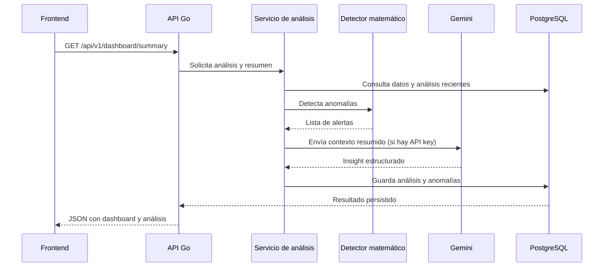

# Integraciones del proyecto

## 1. Integración con datos fuente

El sistema consume dos tipos de información principal:

- lecturas eléctricas,
- eventos operativos.

Estas fuentes se alimentan desde CSV y luego se materializan en PostgreSQL.

### CSV

Los archivos base están en:

- `data/readings.csv`
- `data/events.csv`

La semilla usa el loader de CSV para poblar la base de datos inicial.

### PostgreSQL

La base de datos guarda:

- medidores y lecturas,
- eventos,
- análisis ejecutados,
- anomalías detectadas,
- insight de IA cuando existe.

Esto permite que la aplicación renderice datos persistidos y no solo resultados efímeros de memoria.

## 2. Integración del detector de anomalías

El detector no depende de una API externa. Se ejecuta directamente sobre los datos cargados en memoria o desde la capa de repositorio.

El flujo típico es:

```text
lecturas + eventos -> detector -> anomalías -> guardado -> API
```

El servicio de análisis llama al detector y luego agrega contexto para la explicación final.

## 3. Integración con Gemini

Gemini es una integración opcional que mejora la explicación del análisis.

### Cuando se usa

Se activa solo si `GEMINI_API_KEY` tiene un valor válido.

### Qué se envía

Se envían datos agregados y resumidos, no todas las lecturas crudas:

- número de lecturas,
- número de medidores,
- estadísticas por medidor,
- eventos relevantes,
- anomalías detectadas.

### Qué devuelve

Se espera una respuesta JSON estructurada con:

- `answer`
- `explanation`
- `suggestedQuestions`

La respuesta se guarda junto con el análisis para que el frontend pueda mostrarla sin volver a invocar la IA.

## 4. Integración con la API HTTP

El backend expone la lógica en endpoints REST con Gin.

### Ruta base

- `/api/v1`

### Servicios expuestos

- resumen del dashboard,
- listado de medidores,
- detalle de medidor,
- lecturas de un medidor,
- lista de anomalías,
- detalle de una anomalía,
- análisis de IA,
- consulta de análisis persistido.

El servidor también incluye healthchecks y rate limiting.

## 5. Integración con el frontend

El frontend usa `fetch` hacia la API del backend con una base configurable:

- `VITE_API_BASE_URL`

La capa `frontend/src/api.ts` encapsula las llamadas y mapea las respuestas a tipos TypeScript.

Esto permite mantener la UI desacoplada de los detalles del backend.

## 6. Dependencias principales

### Backend

- Go + Gin
- PostgreSQL
- Google Gemini API
- dotenv para configuración

### Frontend

- React + Vite
- TypeScript
- Recharts
- GSAP
- xlsx + jsPDF para exportación

## 7. Secuencia de ejecución



## 8. Consideraciones operativas

- Si la clave de Gemini no existe, la aplicación sigue funcionando con el detector local.
- La API valida y persiste resultados antes de devolverlos al cliente.
- El backend usa versión de la API para mantener compatibilidad.
- El rate limiter es un mecanismo de protección básico y no sustitute un gateway de producción.

## 9. Conclusión

El proyecto integra datos de operación, lógica analítica, IA explicativa y frontend en una arquitectura con separaciones claras. La integración más importante es la de la lógica de negocio con la infraestructura, porque permite que los hallazgos sean entendibles, comprobables y directamente útiles para decisiones operativas.
